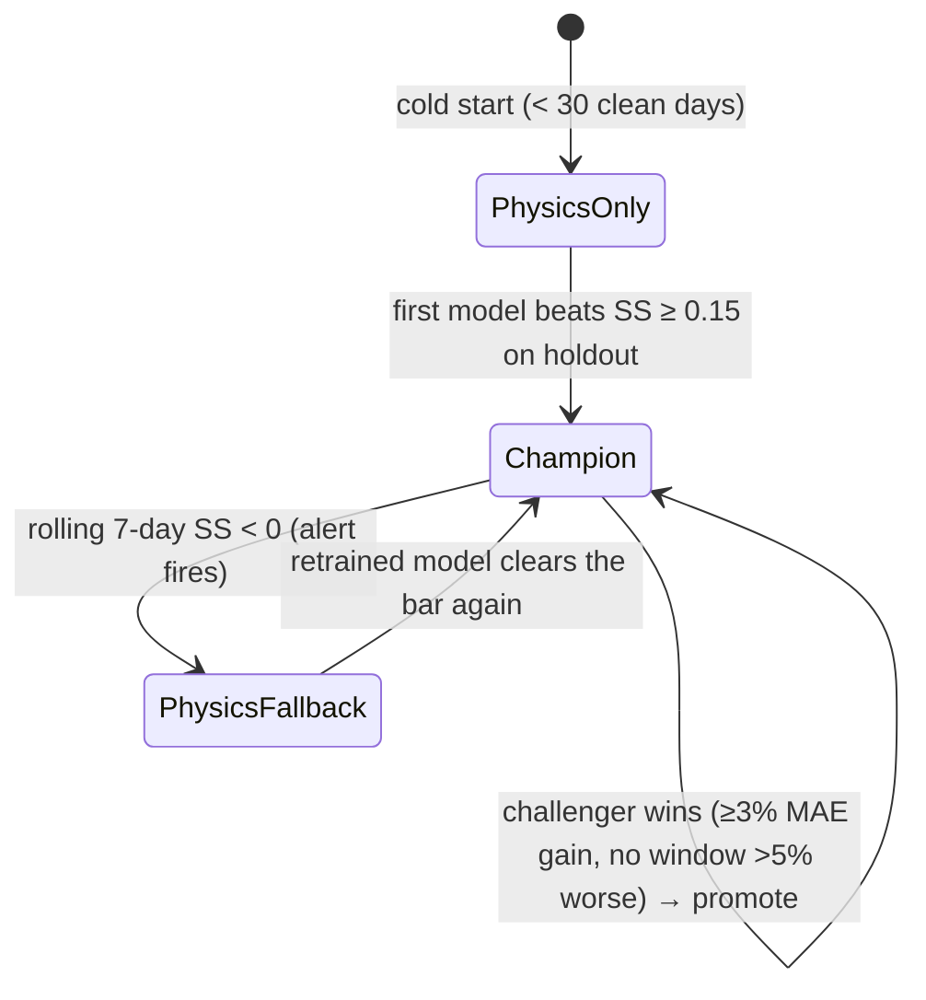

# WhyNoPower — Analytics, Mathematics & Machine Learning

**Status:** Draft for review · July 2026
**Suggested repo path:** `docs/analytics/analytics-and-ml.md`
**Companions:** `docs/database/schema-design.md` (where these numbers live), `docs/architecture/system-design.md` (where they're computed)

This document specifies every computed number in the platform: the deterministic maths, the physics model, the learned models, how they're trained and validated, and how we know when they're wrong. Formulas are given in plain notation; pseudocode where an algorithm matters; every UI figure traces to a section here.

---

## 0. Notation & conventions

| Symbol | Meaning | Unit |
|---|---|---|
| `G_poa` | Plane-of-array (tilted) irradiance for a panel group | W/m² |
| `T_amb` | Ambient temperature | °C |
| `T_cell` | Estimated cell temperature | °C |
| `P_dc`, `P_ac` | DC / AC power | W |
| `E` | Energy | Wh (integer) |
| `kWp_g` | A panel group's rated capacity = count × panel_watt / 1000 | kWp |
| `PR components` | Loss factors (soiling, wiring, mismatch, inverter η) | – |
| `tariff(d)` | Rate in effect on date `d`, from `TARIFFS` history | cents/kWh |

All model computation is per-hour in UTC; daily figures aggregate over the SAST calendar day. Money is computed, never stored: `cents = round_half_even(E_wh × tariff(d) / 1000)`, rounding applied once at the final displayed aggregate (never per-hour then summed).

**Three computational layers**, in increasing sophistication — and each UI number belongs to exactly one:

| Layer | Nature | Examples |
|---|---|---|
| L1 Deterministic analytics | Arithmetic, no uncertainty | Rand conversion, battery hours, weekly sums |
| L2 Physics model | Formula with assumptions | Generation baseline, simulation engine |
| L3 Learned models | Fitted to data, versioned, monitored | Solar regression, restoration-time model, NLP parser |

### UI → formula map

| Screen element | Layer | Section |
|---|---|---|
| "≈ 118 kWh · R413" weekly hero | L2/L3 forecast + L1 tariff | §2–4, §5.1 |
| Hourly day-view bars | L2/L3 hourly forecast | §2, §4 |
| Measured bars (past days) | captured data via rollup | §6.1 |
| "+R7 / −R12" deviation labels | L1 on (measured − issued forecast) | §5.4 |
| "±6% · 14 days" accuracy card | L1 rolling error stat | §5.5 |
| "~4.2 hours" battery card | L1 | §5.2 |
| "Best hours 11:00–14:00" | L1 window over L2/L3 curve | §5.3 |
| Simulation coverage verdicts (P2) | L2 simulation | §7.1 |
| "JW says 18:00 · model says ~21:30" (P3) | L3 quantile model | §8.2 |

---

## 1. The problem the ML actually solves

A naive app would show Open-Meteo's irradiance and multiply by panel watts. WhyNoPower's claim is better: *a forecast corrected by your roof's measured reality.* Between the weather forecast and your meter sit effects no generic formula knows: the neighbour's tree shading Group A after 15:00 in June but not December; dust accumulating between rains; the inverter's efficiency curve at partial load; the panels running hotter than NOCT assumes on your particular roof sheeting. The physics model (§2) captures what's universal; the regression (§4) learns what's *yours*, from ~9 months of Growatt history. The forecast-vs-actual screen then proves — or disproves — that the learning is real. §4.6 defines the automatic fallback if it isn't.

But first, the complication that makes this project's data honest work rather than a Kaggle exercise:

---

## 2. Physics baseline (Layer 2)

Computed per panel group per hour, then summed and clipped.

**Step 1 — POA irradiance.** Consumed directly from Open-Meteo's tilted-radiation API per group orientation (`IRRADIANCE_FORECASTS.plane_irradiance_wm2`). We do not compute solar geometry ourselves (settled in the handoff); the per-group fetch is what makes the two-orientation array first-class.

**Step 2 — Cell temperature (NOCT model).**

```
T_cell = T_amb + ((NOCT − 20) / 800) × G_poa        NOCT = 45 °C assumed
```

**Step 3 — Temperature-corrected DC power.**

```
P_dc_g = kWp_g × 1000 × (G_poa / 1000) × (1 + γ × (T_cell − 25))
γ = −0.004 /°C  (−0.40 %/°C, typical mono-PERC)
```

**Step 4 — Static losses.** Soiling 3%, wiring/connections 2%, mismatch 2% → multiplier `0.97 × 0.98 × 0.98 ≈ 0.932`. These are deliberately *generic* defaults — the regression's job is to correct them to reality; keeping them explicit (not a lumped "PR = 0.8") makes the correction interpretable.

**Step 5 — Sum groups, inverter efficiency, clip.**

```
P_ac = min( η_inv × Σ_g P_dc_g ,  inverter_max_w )      η_inv = 0.96
E_hour_wh = P_ac × 1h
```

### 2.1 Worked example — the real array, clear winter noon

Inputs: `T_amb = 16 °C`; Group A (5×590 W = 2.95 kWp, NE 30°) `G_poa = 780 W/m²`; Group B (3×625 W = 1.875 kWp, SW 80°) `G_poa = 140 W/m²` (winter noon sun is north — B sees mostly diffuse; B earns its keep in late afternoons).

```
A: T_cell = 16 + (25/800)×780 = 40.4 °C  →  factor 1 + (−0.004)(15.4) = 0.938
   P_dc = 2950 × 0.78 × 0.938 = 2159 W  → ×0.932 = 2012 W
B: T_cell = 16 + (25/800)×140 = 20.4 °C  →  factor 1.018
   P_dc = 1875 × 0.14 × 1.018 = 267 W   → ×0.932 = 249 W
Σ P_dc = 2261 W → ×0.96 = 2171 W AC  (< 5000 W cap, no clipping)
E_hour ≈ 2171 Wh ≈ R7.60 at 350 c/kWh
```

A clear winter day integrates to ≈ 15–17 kWh — matching the observed 14–19 kWh/day range, which is the sanity check that the constants are in the right universe. **This example ships as a unit-test fixture** (`PhysicsBaseline` property tests also assert: zero at zero irradiance; never exceeds the AC cap; monotone in `G_poa`).

**Known limits (accepted, documented):** no horizon/row shading model, no panel degradation (system is <1 year old), NOCT is roof-mount-naive, γ generic. All are exactly what §4's regression exists to absorb.

---

## 3. The off-grid curtailment problem (read this section twice)

**The SPF 5000 ES exports nothing.** When the battery is full and household load is low, the inverter *throttles the panels*. Therefore **measured generation = min(potential, demand)** — Growatt records what was *harvested*, not what was *available*. Consequences:

1. **Training poison.** Sunny quiet days appear as "low generation" days. A model trained on raw history learns that clear skies produce little power, and systematically underpredicts.
2. **Phantom underperformance.** A deviation view comparing potential-forecast vs harvested-actual shows the system "missing" its forecast every low-usage sunny day — eroding trust in precisely the screen meant to build it.

**Curtailment detection (per 5-min sample → hour flagged if ≥ 50% of its samples flag):**

```
curtailed(sample) :=
      battery_soc_pct ≥ 97
  AND G_poa_hour > 200 W/m²                (meaningful sun)
  AND ac_power_w < 0.6 × P_physics(hour)   (delivering far below potential)
```

Thresholds are starting values, to be tuned against the backfill (the notebook's first real job). SOC is present in `GENERATION_SAMPLES`; the rule needs no new data.

**Design consequences:**
- **Training set** (§4): curtailed hours are *excluded* — the regression learns the roof's potential, cleanly.
- **Two forecast readings, one pipeline.** *Potential* (model output) drives best-hours advice and the generation curve. *Expected delivered* — `min(potential, typical demand envelope)`, where the envelope is the per-hour median of recent non-curtailed measured usage — drives the rand figure, because in an off-grid system you only save what you consume. Phase 1 may ship with envelope = potential (i.e., ignore the distinction) **only if** backfill analysis shows curtailment < ~5% of energy; the flag in the data decides, and the decision gets recorded in the doc.
- **Deviation view** (§5.4) compares like with like: measured vs *delivered*-basis forecast, with curtailed days badged in the UI ("battery-full day") rather than counted as model error.
- **Accuracy stat** (§5.5) is computed over non-curtailed days only, and says so in its tooltip.

This section is the project's best interview answer: it's where domain reality (off-grid economics) reshapes the ML instead of the ML ignoring it.

---

## 4. The solar regression (Layer 3)

### 4.1 Framing
Supervised regression, **hourly grain**, day-ahead horizon. Target: `E_hour_wh` (measured, non-curtailed hours, daylight only). Hourly gives ~2,500–3,000 training rows from 9 months (vs ~270 daily rows) and lets the model learn hour-of-day-specific effects — which is precisely where shading lives. Daily figures are sums of hourly predictions.

### 4.2 Features — the availability rule
**A feature may be used iff its value is known at forecast issue time.** Everything else is leakage.

| Feature | Source | Note |
|---|---|---|
| `physics_wh` | §2 on forecast inputs | the baseline as a feature — the model learns the *correction* |
| `G_poa` per group (A, B) | irradiance forecast | separate features per group; shading is group-specific |
| `T_amb` forecast | weather forecast | derating beyond NOCT |
| `cloud_cover_pct` | weather forecast | conditions physics under-uses |
| `hour` as sin/cos pair | calendar | cyclic encoding |
| `day_of_year` as sin/cos | calendar | seasonal sun path (shading interactions) |

**Banned:** battery SOC (not known for the future), measured weather actuals, any same-day measured generation, tariff (irrelevant), suburb of other users (single-system Phase 1).

### 4.3 Candidates — an honest bake-off
- **A. Physics-only** (§2). The floor. Ships on day one.
- **B. Ridge on residuals**: `E = physics + f_linear(features)`. Interpretable coefficients ("we lose ~X Wh per cloud-%"); the notebook's first model.
- **C. HistGradientBoostingRegressor** (sklearn), direct target with `physics_wh` as a feature. Captures interactions (hour × season = moving shade); native handling of the small-tabular regime; no external LightGBM dependency.

Selection is empirical via §4.4; the expectation (to be confirmed, not assumed) is C > B > A, with C's margin concentrated in late-afternoon and partly-cloudy hours.

### 4.4 Validation protocol — time-series only
Random K-fold on time series is leakage. Protocol: **expanding-window CV** — train months 1–4 → validate month 5; train 1–5 → validate 6; … — with the most recent full month held out entirely as the final test. Preprocessing (any scaling) is fit on each train window only.

**Metrics** (reported per validation window and pooled):
- `MAE_wh` and its rand translation (what users feel);
- `nMAE = MAE / (kWp × 1000)` — capacity-normalised, comparable across systems later;
- daily-level `MdAPE` (median abs % error on daily totals — median because dawn/dusk hours make hourly MAPE explode);
- **Skill vs physics:** `SS = 1 − MAE_model / MAE_physics`. *The* headline number: SS > 0 means the ML is real. Target to ship model C: `SS ≥ 0.15` on the holdout, i.e. at least 15% better than the formula.

### 4.5 The UI accuracy stat, precisely
"±6% over 14 days" := **MdAPE of daily totals over the trailing 14 non-curtailed days**, comparing measured rollups to the **day-ahead issued forecast** (§5.4's snapshot rule). One definition, stated in the tooltip, used everywhere.

### 4.6 Lifecycle: champion / challenger / physics floor



Weekly retrain in the batch job; every promotion writes a `MODEL_VERSIONS` row (metrics JSON = the §4.4 table); every `GENERATION_FORECASTS` row already stores `physics_wh` beside `predicted_wh`, so **skill is permanently auditable in SQL** — the portfolio's "the ML is real" receipt. Fallback simply serves `predicted = physics` with `model_version_id = NULL`; users see a slightly worse forecast, never an error.

---

## 5. Deterministic analytics (Layer 1)

**5.1 Rand conversion.** `cents(d) = round_half_even(E_wh × tariff(d) / 1000)`, `tariff(d)` = latest `TARIFFS.effective_from ≤ d`. Weekly hero = Σ measured-day cents (their historical tariffs) + Σ forecast-day cents (current tariff), rounded once. Display `R413`, with `≈` whenever any forecast component is included.

**5.2 Battery runtime.** `hours = (battery_capacity_wh × usable_pct/100) / essential_load_w` → one decimal. Stated as battery-only (conservative; daytime outages last longer — that nuance belongs to the simulation, §7.1, not this card).

**5.3 Best-hours window.**
```
peak   = max hourly predicted potential (today)
elig   = hours with prediction ≥ 0.70 × peak
answer = longest contiguous run in elig (ties → earliest)
if run < 2 h → present peak hour ± 1 h instead
```
Uses *potential* (§3) — the sun's offer, regardless of the battery's mood. v2 (parked): appliance-aware absolute threshold (geyser ≈ 3 kW).

**5.4 Deviation ("−R12").** Compare day `d`'s measured rollup against the **day-ahead snapshot**: the `GENERATION_FORECASTS` rows with the greatest `issued_at < d 00:00 SAST`. Later re-issues never rewrite the score — the forecast is graded on what it said *before* the day began. `dev_wh = measured − forecast_delivered_basis`; rand via 5.1; curtailed days badged, not scored (§3).

**5.5 Rolling accuracy.** §4.5's definition. Same number in the card, the tooltip, and the model-monitoring alert — one truth.

**5.6 Weekly aggregation.** Past = measured rollups; today = measured-so-far + remaining-hours forecast; future = forecast. The hero updates through the day without double counting.

---

## 6. Data preparation & hygiene

**6.1 Daily rollup from the counter.** Growatt reports cumulative `energy_today_wh`. Robust daily total = **sum of positive deltas** within the SAST day (immune to mid-day counter resets; a reset contributes a large *negative* delta, which is dropped). `peak_w = max(ac_power_w)`. Gaps: no interpolation — deltas across a gap still capture the energy; a day missing > 4 daylight hours of samples is flagged `partial` and excluded from training and accuracy stats.

**6.2 Sample cleaning.** Drop exact duplicates on `(system, sampled_at)` (upsert makes this structural). Clip `ac_power_w` to `[0, 1.1 × kWp×1000]`, flag clipped rows. Drop negative energy deltas (handled in 6.1). No timezone traps: SA has no DST; UTC+2 constant.

**6.3 Backfill.** The ~9-month ShinePhone history lands through the same adapter → same tables → same cleaning (system-design §7.1 note). First notebook tasks against it, in order: (1) curtailment-rule tuning (§3), (2) share of energy curtailed → the Phase-1 envelope decision, (3) baseline error of physics-only (the number to beat).

**6.4 Leakage checklist (CI-enforced where possible).**
☐ split is chronological ☐ features pass the §4.2 availability rule ☐ preprocessing fit on train only ☐ target excludes curtailed + partial days ☐ holdout month untouched until final eval ☐ same `FeatureBuilder` code path in train and batch-predict.

---

## 7. Phase 2 mathematics (designed now, built in phase)

### 7.1 Loadshedding simulation — discrete-time battery walk
Deterministic, 30-min steps, pure function (unit-testable):

```
state: soc_wh ∈ [0, usable_wh]
params: usable_wh, essential_load_w, charge_cap_w = 2000 (assumption, configurable),
        pv(t) from potential curve, outage(t) from AREA_SCHEDULE_SLOTS × stage
init: soc = 0.5 × usable_wh at Monday 00:00 (stated assumption; UI shows it)

per step dt = 0.5 h:
  if outage(t):
      net = pv(t) − essential_load_w
      soc += clamp(net, −soc/dt, +charge_cap_w) × dt ; clamp soc to [0, usable]
      if soc == 0 and net < 0 → dark_minutes += dt
      verdict(block) accumulates: solar if pv ≥ load, else battery, else dark
  else:
      soc += min(charge_cap_w, pv(t) + grid_charge_w) × dt   ; recharge toward full
outputs: per-block verdicts, total outage h, covered h, dark h  → exactly the mockup's numbers
```

The 02:00-slot insight from the mockup falls straight out of this walk — evening discharge leaves `soc` low by the small hours. Historical replay swaps the forecast `pv(t)` for measured samples and the chosen stage for `STAGE_HISTORY`.

### 7.2 Grid-risk indicator — deliberately humble
Phase 2 ships a **transparent heuristic**, not a model: traffic-light from published EAF trend + unplanned-loss (UCLF) level + season, with thresholds stated in the UI. An anomaly-scoring model is a stretch goal *after* the sync worker has accumulated its own stage/EAF history — the honest sequencing is data first, model later.

---

## 8. Phase 3 ML (designed now, built in phase)

### 8.1 Notice parsing — extraction with a gate
LLM structured-output extraction (JSON schema: areas[], cause ∈ taxonomy, planned flag, reported/planned/restore times), few-shot with SA-specific examples. **Validation gate** before any DB write: parse dates sane, times ordered, suburbs fuzzy-matched to `SUBURBS` (normalised token-set ratio ≥ 0.85) — failures quarantine for manual review (system-design §9.2). **Evaluation:** ≥ 50 hand-labelled notices; field-level scores; provisional ship bar: planned-flag accuracy ≥ 0.95, suburb-set F1 ≥ 0.85, cause accuracy ≥ 0.80, times within ±30 min ≥ 0.80. The labelled set is itself a committed artifact (`ml/data/water_notices_gold.jsonl`).

### 8.2 Restoration time — quantiles, not points
`HistGradientBoostingRegressor(loss="quantile")` at **P50 and P80** on duration (minutes); features: cause, planned flag, suburb zone, hour-of-day reported, zone's rolling median. UI renders honesty: "likely by 21:30 (P50) · almost certainly by 02:00 (P80)". Cold start: `(cause × zone)` historical medians until n ≥ 30 resolved outages. Scoring: pinball loss per quantile + P80 coverage (target: ≥ 75% of outages resolve before their P80). JW's own estimate is scored alongside as the baseline to beat — the feed's "model vs JW" card is that comparison, live.

---

## 9. Monitoring — knowing when we're wrong

Nightly, the batch job grades yesterday: writes nothing new (forecasts + rollups already hold everything) but computes day-ahead error, updates the rolling SS, and alerts on: 7-day SS < 0 (→ physics fallback, §4.6), accuracy-stat regression > 3 pp week-over-week, batch silence > 24 h, curtailed-energy share drifting > 10 pp (the envelope decision may need revisiting). Model registry rows make every historical forecast attributable to the exact version that produced it — drift is diagnosable in SQL, not folklore.

## 10. Explicitly out of scope (Phase 1)
Horizon-profile shading models; panel degradation terms; probabilistic *solar* forecasts (quantiles are Phase 3's trick first — solar P10/P90 bands are a stretch goal); per-appliance load disaggregation; multi-system transfer learning (needs users who aren't Matthew).

## 11. Open items
1. Curtailment thresholds (§3) tuned on backfill — first notebook deliverable.
2. Envelope-vs-potential rand basis decision — made by the backfill's curtailed-energy share, recorded here when made.
3. `charge_cap_w` for the SPF 5000 ES — confirm from the device list when ShinePhone access lands (handoff open item).
4. ADR-009 candidate: "Physics-first forecasting with learned residual correction and automatic physics fallback" — this document is its long form.
