# WhyNoPower — Database Design

**Status:** Draft for review · July 2026
**Suggested repo path:** `docs/database/schema-design.md`
**Scope:** Full-platform ERD (all three phases), with Phase 1 (Solar) tables specified in most detail. Phase 2/3 tables are designed now so Phase 1 decisions don't paint us into a corner, but they are not built until their phase begins (ADR-003).

---

## 1. Conventions

| Rule | Detail |
|---|---|
| Timestamps | All stored UTC (`datetime2`). SAST is display-only. Columns named `*_utc` where ambiguity is possible. |
| Daily grain | Daily rollups/forecasts keyed by `date_local` — the **SAST calendar day** — because "Tuesday's generation" means the South African Tuesday. Solar generation never straddles the SAST/UTC day boundary (22:00 UTC), so this is safe. |
| Energy | Integer **watt-hours** (`_wh`), never kWh floats. |
| Power | Integer **watts** (`_w`). |
| Money | Integer **cents per kWh** (`rate_cents_per_kwh`); R3.50 → 350. Rand values are always computed, never stored. |
| Keys | `bigint` identity PKs for app tables; ASP.NET Identity keeps its default key type for `AspNetUsers`. |
| Location | Suburb-level only, per POPIA-by-design. No street addresses anywhere in the schema. |
| Raw-first | External data is stored as received (raw payload / raw text) *and* as parsed rows. Parsed rows reference their raw source. (ADR-005 pattern, applied platform-wide.) |
| Captured vs derived | Tables never mix ground truth with model output. Derived tables carry a `model_version_id`. |

---

## 2. ERD

```mermaid
erDiagram
    %% ═══════════ IDENTITY & LOCATION ═══════════
    ASPNET_USERS ||--|| USER_PROFILES : "1:1 profile"
    USER_PROFILES ||--o{ USER_SUBURBS : follows
    SUBURBS ||--o{ USER_SUBURBS : ""
    USER_PROFILES ||--o{ SYSTEMS : owns
    SUBURBS ||--o{ SYSTEMS : "located in"

    %% ═══════════ SOLAR (PHASE 1) ═══════════
    SYSTEMS ||--o{ PANEL_GROUPS : has
    SYSTEMS ||--o{ TARIFFS : "tariff history"
    SYSTEMS ||--o{ INVERTER_CONNECTIONS : "monitoring link"
    SYSTEMS ||--o{ GENERATION_SAMPLES : "measured 5-min"
    SYSTEMS ||--o{ DAILY_GENERATION_ROLLUPS : "daily totals"
    SYSTEMS ||--o{ MANUAL_GENERATION_ENTRIES : "fallback input"
    SYSTEMS ||--o{ GENERATION_FORECASTS : "predicted"
    PANEL_GROUPS ||--o{ IRRADIANCE_FORECASTS : "per-orientation"
    SUBURBS ||--o{ WEATHER_FORECASTS : "display weather"
    RAW_INGEST_PAYLOADS ||--o{ GENERATION_SAMPLES : "parsed from"
    MODEL_VERSIONS ||--o{ GENERATION_FORECASTS : "produced by"

    %% ═══════════ POWER (PHASE 2) ═══════════
    ESP_AREAS ||--o{ AREA_SCHEDULE_SLOTS : "stage slots"
    ESP_AREAS ||--o{ SUBURBS : "maps to"

    %% ═══════════ WATER (PHASE 3) ═══════════
    WATER_NOTICES ||--o{ WATER_OUTAGES : "parsed into"
    WATER_OUTAGES ||--o{ WATER_OUTAGE_SUBURBS : affects
    SUBURBS ||--o{ WATER_OUTAGE_SUBURBS : ""
    WATER_OUTAGES ||--o{ RESTORATION_PREDICTIONS : ""
    MODEL_VERSIONS ||--o{ RESTORATION_PREDICTIONS : "produced by"

    ASPNET_USERS {
        string id PK "ASP.NET Identity default"
        string email
        string password_hash "managed by Identity"
    }

    USER_PROFILES {
        bigint id PK
        string aspnet_user_id FK "1:1 to Identity"
        nvarchar display_name
        datetime2 ad_free_until "reward placeholder (nullable)"
        datetime2 created_at_utc
    }

    SUBURBS {
        bigint id PK
        nvarchar name
        nvarchar municipality "e.g. City of Johannesburg"
        nvarchar province
        decimal lat "suburb centroid, for weather queries"
        decimal lng
        bigint esp_area_id FK "nullable until Phase 2 mapping"
    }

    USER_SUBURBS {
        bigint id PK
        bigint user_profile_id FK
        bigint suburb_id FK
        nvarchar label "home / work / other"
        bit is_primary
    }

    SYSTEMS {
        bigint id PK
        bigint user_profile_id FK
        bigint suburb_id FK
        nvarchar name "e.g. Home system"
        int inverter_max_w "AC clipping cap"
        nvarchar inverter_type "off_grid / hybrid / grid_tied"
        int battery_capacity_wh "nullable — no battery"
        int battery_usable_pct "default 80"
        int essential_load_w "outage load from power page"
        datetime2 created_at_utc
        datetime2 updated_at_utc
    }

    PANEL_GROUPS {
        bigint id PK
        bigint system_id FK
        int panel_count
        int panel_watt
        int azimuth_deg "nullable — user skipped; default applied at compute time"
        int tilt_deg "nullable — user skipped; default applied at compute time"
    }

    TARIFFS {
        bigint id PK
        bigint system_id FK
        int rate_cents_per_kwh "R3.50 = 350"
        date effective_from
    }

    INVERTER_CONNECTIONS {
        bigint id PK
        bigint system_id FK
        nvarchar provider "growatt (only, Phase 1)"
        nvarchar username
        varbinary credentials_encrypted "never plaintext; Key Vault-wrapped"
        nvarchar datalogger_sn
        nvarchar status "connected / disconnected / error"
        datetime2 last_synced_at_utc
    }

    RAW_INGEST_PAYLOADS {
        bigint id PK
        nvarchar source "growatt / open_meteo / esp / jw"
        nvarchar payload_json "as received"
        int http_status
        char content_hash "dedupe"
        datetime2 fetched_at_utc
    }

    GENERATION_SAMPLES {
        bigint id PK
        bigint system_id FK
        bigint raw_payload_id FK
        datetime2 sampled_at_utc "~5-min grain"
        int ac_power_w
        int energy_today_wh "counter as reported"
        int battery_soc_pct "nullable"
    }

    DAILY_GENERATION_ROLLUPS {
        bigint id PK
        bigint system_id FK
        date date_local "SAST calendar day"
        int total_wh
        int peak_w
        nvarchar source "measured / manual"
        datetime2 computed_at_utc
    }

    MANUAL_GENERATION_ENTRIES {
        bigint id PK
        bigint system_id FK
        date date_local
        int total_wh
        datetime2 entered_at_utc "feeds rollup with source=manual; triggers ad_free reward"
    }

    WEATHER_FORECASTS {
        bigint id PK
        bigint suburb_id FK
        datetime2 issued_at_utc "forecast run time"
        datetime2 target_hour_utc
        decimal temp_c
        int cloud_cover_pct
        nvarchar condition_code "for icon display"
    }

    IRRADIANCE_FORECASTS {
        bigint id PK
        bigint panel_group_id FK
        datetime2 issued_at_utc
        datetime2 target_hour_utc
        int plane_irradiance_wm2 "tilted-plane, per group orientation"
        decimal ambient_temp_c "derating input"
    }

    GENERATION_FORECASTS {
        bigint id PK
        bigint system_id FK
        bigint model_version_id FK "nullable — physics-only rows"
        datetime2 issued_at_utc
        date target_date_local
        datetime2 target_hour_utc "nullable — null = daily total row"
        int physics_wh "baseline formula output"
        int predicted_wh "ML-corrected; = physics if no model yet"
    }

    MODEL_VERSIONS {
        bigint id PK
        nvarchar domain "solar_regression / water_restoration"
        nvarchar version
        datetime2 trained_at_utc
        nvarchar metrics_json "MAE, R2, sample count"
        nvarchar notes
    }

    ESP_AREAS {
        bigint id PK
        nvarchar esp_area_id "EskomSePush area id"
        nvarchar name
        nvarchar region
    }

    AREA_SCHEDULE_SLOTS {
        bigint id PK
        bigint esp_area_id FK
        int stage "1-8"
        int day_of_month "ESP schedule shape"
        time start_time
        time end_time
    }

    STAGE_HISTORY {
        bigint id PK
        int stage "0 = none"
        datetime2 started_at_utc
        datetime2 ended_at_utc "nullable — ongoing"
        nvarchar source "esp"
    }

    WATER_NOTICES {
        bigint id PK
        nvarchar source_url
        nvarchar raw_text "notice as scraped"
        char content_hash "dedupe re-scrapes"
        datetime2 scraped_at_utc
    }

    WATER_OUTAGES {
        bigint id PK
        bigint water_notice_id FK "latest notice"
        nvarchar title
        nvarchar cause "burst_main / valve / maintenance / unknown"
        bit is_planned
        nvarchar status "active / restored / scheduled"
        datetime2 reported_at_utc
        datetime2 planned_start_utc "nullable"
        datetime2 jw_estimated_restore_utc "nullable"
        datetime2 actual_restored_at_utc "nullable"
    }

    WATER_OUTAGE_SUBURBS {
        bigint id PK
        bigint water_outage_id FK
        bigint suburb_id FK
    }

    RESTORATION_PREDICTIONS {
        bigint id PK
        bigint water_outage_id FK
        bigint model_version_id FK
        int predicted_duration_min
        datetime2 predicted_at_utc
    }
```

---

## 3. Table rationale, by group

### Identity & location

**ASPNET_USERS / USER_PROFILES.** ASP.NET Core Identity generates and owns its own tables (`AspNetUsers`, `AspNetRoles`, etc.) — we don't fight that. App-specific fields live in a 1:1 `USER_PROFILES` table instead of customising the Identity table, keeping auth concerns and app concerns separable. `ad_free_until` is the entire storage footprint of the feature-flagged ad/reward mechanic: contributing a manual reading stamps it 24h ahead. No ad-network tables, by design.

**SUBURBS** is a shared reference table, not free text. Everything location-flavoured (users, systems, weather, water outages, ESP mapping) points at it, which is what makes cross-domain queries possible ("outages affecting suburbs I follow"). Centroid lat/lng gives Open-Meteo a POPIA-safe query point. Seeding strategy: start with Johannesburg suburbs (a static seed list), grow as needed — flagged as an open item below.

**USER_SUBURBS** exists because the water page's "follow another suburb (e.g. work)" is many-to-many. `is_primary` marks the one that pre-fills forms.

### Solar — captured truth

**SYSTEMS** holds everything the wizard captures at system level, including `essential_load_w` from the power page (it's a household attribute, so it lives here rather than in a power-domain table). `battery_capacity_wh` nullable = no battery.

**PANEL_GROUPS** is plural per system with per-group tilt/azimuth — the two-orientation array is the whole reason this table exists. Tilt/azimuth are **nullable**: null records that the user skipped the optional field, and defaults (north, latitude-based tilt) are applied at computation time, not silently written into their profile. That preserves the distinction between "user told us 30°" and "we assumed 26°" — which matters when the accuracy screen explains forecast error.

**TARIFFS** is effective-dated history, not a column on SYSTEMS. NERSA increases land every July; a single mutable column would silently corrupt every historical rand figure after the first increase. Current tariff = latest `effective_from` ≤ today.

**INVERTER_CONNECTIONS** (ADR-005): Growatt credentials encrypted at rest (`varbinary`, Key Vault-wrapped key), datalogger serial, connection status — which is exactly what drives the "Inverter synced 2h ago / disconnected" chip in the UI.

**RAW_INGEST_PAYLOADS** is the platform-wide raw-first landing zone (ADR-005 generalised): every external fetch stored as received, with a content hash for dedupe. Parsed rows point back at it, giving an audit trail and re-parse capability when upstream formats shift.

**GENERATION_SAMPLES** — the ~5-minute Growatt grain, ~100k rows/system/year. This is ML training data and is never aggregated in place.

**DAILY_GENERATION_ROLLUPS** — the dashboard's read model, computed from samples (or manual entries, distinguished by `source`). The raw+rollup split is the ADR-006 candidate flagged in the handoff.

**MANUAL_GENERATION_ENTRIES** — the fallback path for unsupported inverters, kept as its own captured-truth table (not written straight into rollups) so a user's hand-entered numbers are never confused with measured ones.

### Solar — derived

**WEATHER_FORECASTS vs IRRADIANCE_FORECASTS — two tables, two grains.** Display weather (temp, cloud, icon) is suburb-level. Irradiance is fetched **per panel-group orientation** (Open-Meteo tilted-plane) because your NE-30° and SW-80° groups genuinely receive different energy — and per-group irradiance is the regression's input feature. Both store `issued_at` + `target_hour` because *training requires the forecast as it was issued*, not what the weather turned out to be. Forecasts are append-only; re-issues create new rows.

**GENERATION_FORECASTS** stores `physics_wh` and `predicted_wh` side by side on every row. That single design choice powers the portfolio's best chart: physics baseline vs ML-corrected vs measured. `model_version_id` is null for pre-ML rows (predicted = physics), so the "before the model existed" era is honestly represented.

**MODEL_VERSIONS** — lightweight model registry (domain, version, metrics JSON). Every derived row references the model that produced it, so accuracy stats can be computed per version and the "±6% over 14 days" card is a real query.

### Power (Phase 2 — designed, not built)

**ESP_AREAS / AREA_SCHEDULE_SLOTS / STAGE_HISTORY** mirror EskomSePush's own shapes: areas, per-stage schedule slots keyed by day-of-month, and a national stage timeline. The sync worker (ADR-004) writes these; the simulation view reads schedule slots + a chosen stage; the historical replay reads `STAGE_HISTORY`. `SUBURBS.esp_area_id` (nullable until Phase 2) is the join that makes "your suburb's schedule" work.

### Water (Phase 3 — designed, not built)

**WATER_NOTICES → WATER_OUTAGES → WATER_OUTAGE_SUBURBS** is the scraping pipeline made relational: raw text as scraped (with hash dedupe), the NLP-parsed structured outage, and the many-to-many suburb fan-out (one burst affects several suburbs — exactly what the feed cards show). **RESTORATION_PREDICTIONS** keeps model output separate from JW's official estimate (a captured fact on WATER_OUTAGES), which is what lets the UI show "JW says 18:00 · our model says 21:30" and later score both.

---

## 4. Indexing & performance notes (Phase 1)

- `GENERATION_SAMPLES`: clustered/covering index on `(system_id, sampled_at_utc)` — every ML export and chart query hits this pair.
- `DAILY_GENERATION_ROLLUPS`: unique `(system_id, date_local)`.
- `GENERATION_FORECASTS`: index `(system_id, target_date_local, issued_at_utc)` — "latest forecast for day X" is the hot query.
- `IRRADIANCE_FORECASTS`: index `(panel_group_id, target_hour_utc, issued_at_utc)`.
- `RAW_INGEST_PAYLOADS`: index on `content_hash` for dedupe; consider a retention/archive policy once row counts warrant it (not a Phase 1 problem).

## 5. Security & POPIA posture

- No street addresses, GPS points, or free-text locations anywhere — suburb FK only.
- Growatt credentials: encrypted at rest, key in Azure Key Vault, never logged, never returned by any API.
- Least-privilege DB accounts: the API's login gets CRUD on app tables only; the ML service gets read on samples/forecasts and write on forecast/prediction tables only.
- All access parameterised (EF Core); no dynamic SQL.
- Deletion story: deleting a user cascades profile → systems → panel groups → samples/rollups/forecasts. Raw payloads containing per-user data (Growatt) cascade too; shared payloads (ESP, weather) don't reference users at all.

## 6. Open items

1. **Suburb seed source** — static Johannesburg seed list vs importing a gazetteer. Static list is fine for Phase 1; decide before Phase 3 (water) where suburb matching quality matters most.
2. **Actual-weather observations table** — useful later for "cloud arrived earlier than predicted" explanations, but not required to train the regression (which needs forecasts + measured generation). Deferred; add when the deviation-explanation feature is built.
3. **ADR-006** — the raw-samples + daily-rollup time-series strategy (and append-only forecast snapshots) should be written up as an ADR now that it's concrete.
