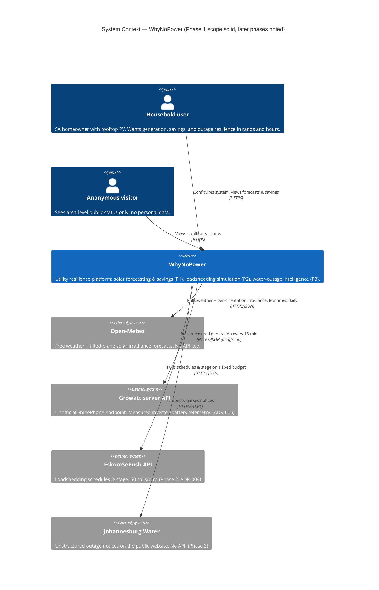
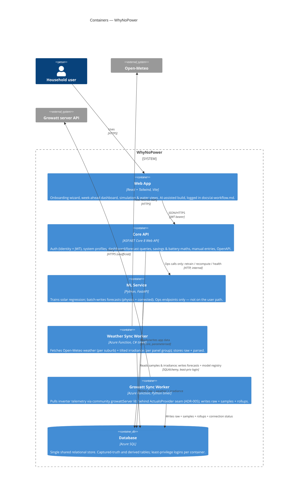
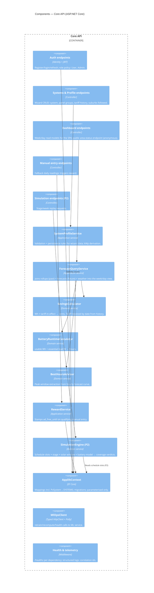
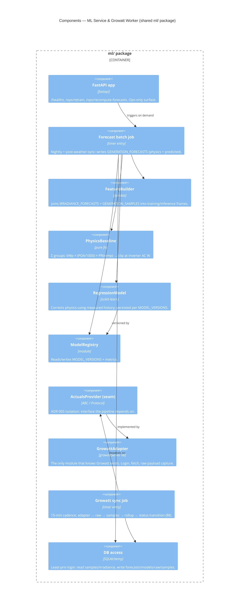
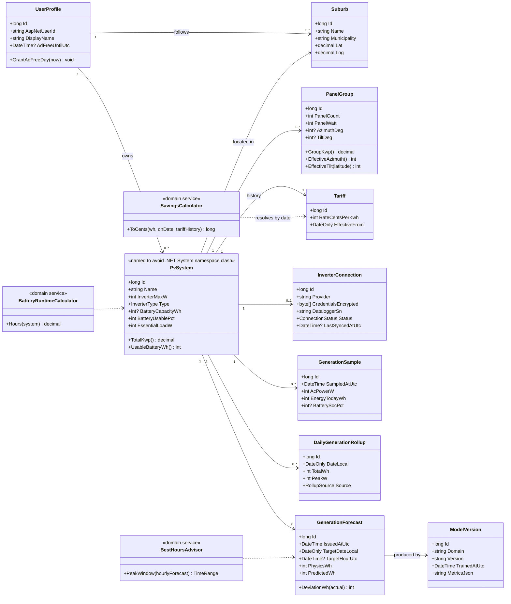
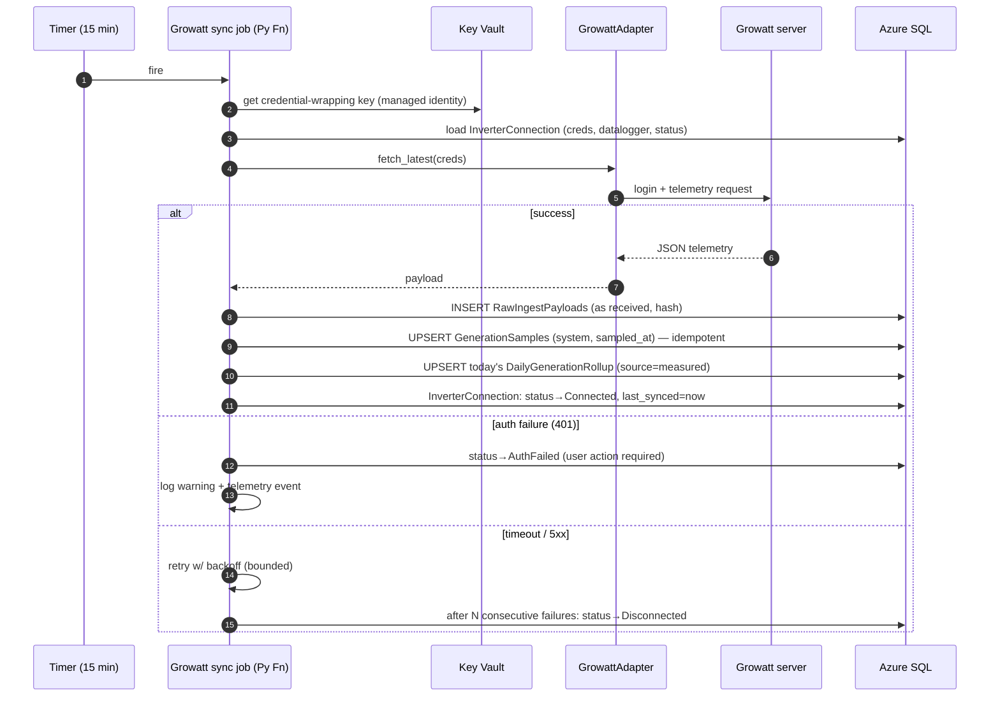
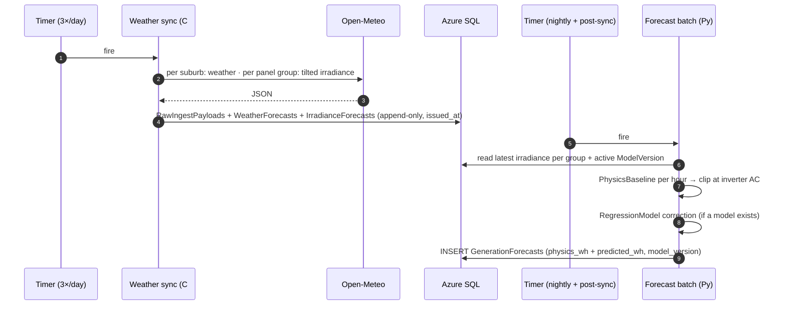
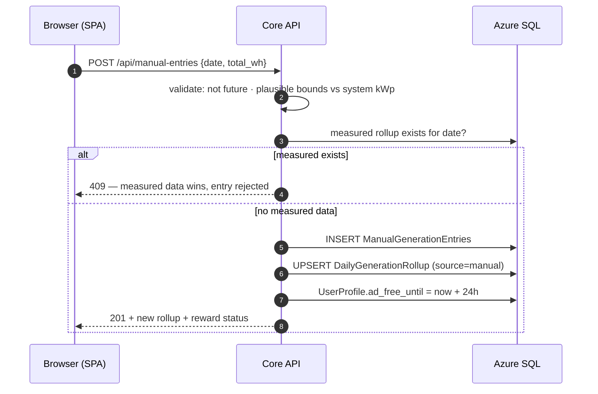
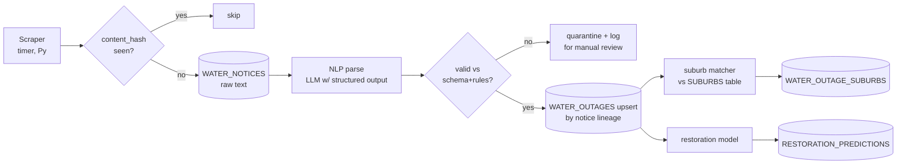

# WhyNoPower — System Design

**Status:** Draft for review · July 2026
**Suggested repo path:** `docs/architecture/system-design.md`
**Companion documents:** `docs/database/schema-design.md` (ERD), `docs/adr/` (decisions 0001–0005)

This document describes the system top-down: C4 Context → Containers → Components → Deployment, then inward with UML (class, sequence, state) for the Phase 1 domain, and finally the designed-but-not-yet-built shape of Phases 2–3. Every diagram is Mermaid, so GitHub renders this file as living documentation — no exported images to drift out of date.

---

## 0. Diagram inventory

| # | Diagram | Method | Section | Answers the question |
|---|---|---|---|---|
| 1 | System Context | C4 L1 | §2 | Who uses it, what does it talk to? |
| 2 | Containers | C4 L2 | §3 | What are the deployable pieces? |
| 3 | API Components | C4 L3 | §4.1 | How is the ASP.NET Core API structured inside? |
| 4 | ML Service Components | C4 L3 | §4.2 | How is the Python side structured inside? |
| 5 | Deployment | C4 Deployment | §5 | What runs where on Azure? |
| 6 | Core Domain | UML Class | §6 | What are the domain objects and seams? |
| 7 | Growatt sync | UML Sequence | §7.1 | How do measured samples get in? (ADR-005) |
| 8 | Forecast pipeline | UML Sequence | §7.2 | How does a forecast come to exist? |
| 9 | Dashboard read | UML Sequence | §7.3 | Why is the user path fast and resilient? |
| 10 | Manual entry + reward | UML Sequence | §7.4 | How does the fallback/reward mechanic work? |
| 11 | Inverter connection | UML State | §8 | What drives the sync-status chip? |
| 12 | Water NLP pipeline | Flowchart | §9.2 | How will Phase 3 turn text into rows? |

---

## 1. Architecture overview & principles

WhyNoPower is a **modular monolith core with satellite workers and one ML sidecar**, not a microservices system. Five principles shape every diagram below:

1. **Data platform, not proxy** (ADR-004 generalised). External sources are ingested on *our* schedule into *our* database; users are always served from our data. This applies to EskomSePush (quota), Growatt (unofficial API), Open-Meteo (courtesy), and — the new decision in this document — to our own ML service.
2. **ML off the hot path.** No user request ever blocks on the Python service. Forecasts are precomputed in batch and read from Azure SQL like any other data. The ML service's synchronous API exists for operations (retrain, recompute, health), not for serving users. *(ADR-007 candidate.)*
3. **Raw-first ingestion** (ADR-005 generalised). Every external payload is stored as received, then parsed. Parsed rows reference their raw source. Re-parseable, auditable, format-change-tolerant.
4. **Captured truth vs derived data.** The schema separates what was measured/entered from what was computed; the architecture keeps the writers separate too (workers write truth, ML writes derived, API mostly reads).
5. **Vertical slices** (ADR-003). Phase 2/3 elements appear in these diagrams greyed/annotated — designed so Phase 1 doesn't block them, built only when their phase begins.

---

## 2. C4 Level 1 — System Context



**Reading notes.** Two actor types encode the anonymous/authenticated security boundary from the brief: the public "status page" view exists precisely so there is a deliberate, designed logged-out surface rather than an accidental one. All four external systems are *pull-only* — WhyNoPower initiates every exchange, holds no inbound webhooks, and can therefore survive any of them being down (it just serves its latest data). The arrows to ESP and JW exist at context level now, even though their phases aren't built, because the system's identity — the reason it's called a *resilience platform* — is the combination.

---

## 3. C4 Level 2 — Containers



### 3.1 Container responsibilities & boundaries

| Container | Owns | Explicitly does *not* |
|---|---|---|
| **Web App (React)** | All UI states incl. degraded "forecast-only" mode; client-side validation as UX nicety | Business rules (server re-validates everything); direct external API calls |
| **Core API (C#)** | AuthN/AuthZ, profile CRUD, all read models for dashboards, rand/battery/best-hours calculations, manual entries + reward stamping | Talking to Growatt/Open-Meteo (workers do), running ML (Python does), serving forecasts it computed itself |
| **ML Service (Python)** | Feature building, physics baseline, regression train/predict, batch forecast writes, model registry rows | Auth, user data mutation, anything a user request waits on |
| **Weather Sync (C# Fn)** | Open-Meteo fetch orchestration per suburb & per panel-group orientation; raw+parsed writes | Interpreting forecasts (ML's job) |
| **Growatt Sync (Py Fn)** | ShinePhone login, telemetry pull, raw+samples+rollup writes, `INVERTER_CONNECTIONS.status` transitions | Being on any user-facing path |
| **Azure SQL** | Single source of truth, integrity constraints, the contract between languages | — |

**Why the boundaries sit here.** The C#/Python split follows ADR-001 (each language where it's strongest). The *workers-as-Functions* choice keeps scheduled concerns out of the API's process (App Service free-tier instances sleep; Functions timers don't care), and gives each ingestion its own failure domain and logs. The database is deliberately the integration point between C# and Python — a shared relational contract with per-login least privilege — rather than an internal HTTP mesh, which would add failure modes without adding portfolio value. The one HTTP link (API→ML) is operational only.

**Polyglot consequence worth noting:** an Azure Function App is single-runtime, so the C# weather worker and Python Growatt worker are **two Function Apps**, not two functions in one app. Cheap on free tier, but it must be reflected in CI/CD (§5).

---

## 4. C4 Level 3 — Components

### 4.1 Inside the Core API (ASP.NET Core)



**Design notes.**
- Layering is *pragmatic clean-ish*: Controllers → application services → domain services → EF Core. No repository layer over EF (EF **is** the repository); the tests mock at the service seams instead. This is a deliberate anti-ceremony choice worth an interview sentence.
- `SavingsCalculator` takes a **date** and resolves the tariff from `TARIFFS` history — the schema decision (§schema-design) surfaces here as an API-level guarantee that historical rand figures never drift.
- The **public status endpoint** lives in Dashboard endpoints with `[AllowAnonymous]` and serves *suburb-level aggregates only* — the designed anonymous surface from §2.
- Where's the ADR-005 `IActualsProvider` seam? **Not here.** The API never talks to Growatt; measured data reaches it as rows. The isolation seam lives in the Python worker (§4.2), where Growatt is actually touched. Putting an unused interface in C# would be architecture theatre.

### 4.2 Inside the ML Service + Growatt worker (Python)

The `ml/` folder is one Python package with two entrypoints (FastAPI app; Growatt timer Function) sharing modules:



**Design notes.** `PhysicsBaseline` is a pure function — trivially unit-testable, and its output is stored per forecast row so the model's *lift over physics* is always measurable. A future non-Growatt inverter (or an official API) is a new `ActualsProvider` implementation; nothing upstream changes — that's ADR-005's promise made concrete. Notebook→service promotion path: exploration happens in `ml/notebooks/`, and code graduates into these modules; the notebook never becomes load-bearing.

---

## 5. C4 Deployment — Azure

```mermaid
C4Deployment
    title Deployment — Azure (Phase 1)

    Deployment_Node(gh, "GitHub", "Source + CI/CD") {
        Container(actions, "GitHub Actions", "CI/CD", "Build+test on PR; deploy on merge to main. One workflow per deployable.")
    }

    Deployment_Node(az, "Azure subscription", "Azure for Students") {
        Deployment_Node(swa, "Static Web Apps", "Free tier") {
            Container(spa_d, "Web App", "React build artefacts")
        }
        Deployment_Node(asp1, "App Service (Linux)", "Free/B1") {
            Container(api_d, "Core API", "ASP.NET Core 8")
        }
        Deployment_Node(asp2, "App Service (Linux)", "Free/B1") {
            Container(ml_d, "ML Service", "FastAPI + gunicorn")
        }
        Deployment_Node(fn1, "Function App — dotnet", "Consumption") {
            Container(wsync_d, "Weather Sync", "C# timer")
        }
        Deployment_Node(fn2, "Function App — python", "Consumption") {
            Container(gsync_d, "Growatt Sync + forecast batch", "Python timers")
        }
        Deployment_Node(sqln, "Azure SQL", "Serverless / free offer") {
            ContainerDb(db_d, "whynopower-db", "3 least-priv logins: api, ml, workers")
        }
        Deployment_Node(kv, "Key Vault", "") {
            Container(secrets, "Secrets", "JWT signing key, Growatt creds key, conn strings")
        }
        Deployment_Node(ai, "Application Insights", "") {
            Container(tel, "Telemetry", "Structured logs, traces, alerts")
        }
    }

    Rel(actions, swa, "deploy")
    Rel(actions, asp1, "deploy")
    Rel(actions, asp2, "deploy")
    Rel(actions, fn1, "deploy")
    Rel(actions, fn2, "deploy")
    Rel(api_d, db_d, "TLS")
    Rel(ml_d, db_d, "TLS")
    Rel(wsync_d, db_d, "TLS")
    Rel(gsync_d, db_d, "TLS")
    Rel(api_d, secrets, "managed identity")
    Rel(gsync_d, secrets, "managed identity")
```

**Deployment notes.**
- **Local dev mirrors this** with docker-compose: `api`, `ml`, `frontend`, `sql` (Azure SQL Edge image), plus the two workers runnable as plain processes. Kubernetes remains explicitly out of scope (ADR-002).
- **Secrets flow:** nothing in Git ever; local `.env` (gitignored) → GitHub Actions secrets → App/Function settings referencing Key Vault via **managed identity** (no connection secrets in app settings at all). Growatt credentials are additionally encrypted at the column level; Key Vault holds the wrapping key.
- **CI/CD shape (monorepo):** path-filtered workflows — `api/**` builds/tests/deploys the API; `ml/**` the ML service and Python Function App; `frontend/**` the SWA; `docs/**` runs link/lint only. PRs must be green to merge (branch protection already live).
- Free-tier honesty: App Service free instances cold-start; acceptable for a portfolio demo and irrelevant to workers (Functions) and to data freshness (batch model).

---

## 6. UML Class Diagram — Phase 1 core domain



**Reading notes.** Nullable `TiltDeg/AzimuthDeg` pair with `EffectiveTilt/EffectiveAzimuth()` — the *entity remembers what the user actually said*; defaults are applied by behaviour, never written back. `GenerationForecast.DeviationWh(actual)` is where "−R12" is born (via `SavingsCalculator`). Domain services are stateless and pure where possible; they are the primary unit-test surface. The Python side deliberately has no mirrored class model — it works in DataFrames against the same tables; the **database is the shared contract**, and duplicating an ORM domain in two languages would double maintenance for zero benefit.

---

## 7. UML Sequence Diagrams — key flows

### 7.1 Growatt sync (measured truth enters the system)



Idempotent upserts make the job safe to re-run (missed timer, overlapping run, backfill). The **9-month history backfill** is this same path fed by a one-off range fetch/CSV import — it writes the identical tables, so ML training data and live data are indistinguishable by construction.

### 7.2 Forecast pipeline (a prediction comes to exist)



Append-only + `issued_at` on both weather and generation forecasts means the system can always answer *"what did we believe on Tuesday morning?"* — which is precisely the training set, and also the honest basis for the accuracy screen.

### 7.3 Dashboard read (why the user path is fast and unbreakable)

```mermaid
sequenceDiagram
    autonumber
    participant U as Browser (SPA)
    participant A as Core API
    participant DB as Azure SQL

    U->>A: GET /api/dashboard/week (JWT)
    A->>A: authenticate + authorize (owner of system)
    A->>DB: rollups (past days) + latest forecasts (future) + weather + tariff history + connection status
    DB-->>A: rows
    A->>A: SavingsCalculator (cents, tariff-by-date) · deviations · battery hours · best window
    A-->>U: one JSON view model (incl. sync-status chip state)
    Note over U,DB: Zero external calls. Growatt down? ML down?<br/>Page still renders; chip says "last synced 6h ago".
```

This is principle 2 made visible: the entire user experience degrades to *staleness*, never to *failure*.

### 7.4 Manual entry + reward (fallback path & placeholder mechanic)



"Measured wins" is a data-integrity rule: hand-entered numbers can never overwrite inverter telemetry. The reward stamp is the *entire* ad mechanic — the ad slot itself is a feature-flagged placeholder in the SPA, per the settled Phase 1 scope.

---

## 8. UML State Diagram — InverterConnection

The status chip in the UI ("synced 2h ago" / "offline — forecast only") renders whatever this machine last wrote:

```mermaid
stateDiagram-v2
    [*] --> Unverified : user saves credentials
    Unverified --> Connected : first successful sync
    Unverified --> AuthFailed : 401 on first sync
    Connected --> Connected : sync ok (refresh last_synced)
    Connected --> Disconnected : N consecutive timeouts/5xx
    Disconnected --> Connected : sync ok
    Connected --> AuthFailed : 401 (password changed)
    Disconnected --> AuthFailed : 401
    AuthFailed --> Unverified : user re-enters credentials
    note right of Disconnected : Transient — job keeps retrying.\nUI: "offline — showing forecast only".
    note right of AuthFailed : Terminal until user acts.\nUI prompts re-auth; no retries (avoid lockout).
```

`Disconnected` (keep trying) vs `AuthFailed` (stop and ask the human) is the important distinction — retrying a bad password against an unofficial endpoint risks account lockout on a service with no support channel.

---

## 9. Phase 2–3 design outlook (designed now, built later)

### 9.1 Loadshedding simulation (Phase 2)
`SimulationEngine` (§4.1) is a pure domain service: inputs = `AREA_SCHEDULE_SLOTS` (for suburb's ESP area, chosen stage) + hourly generation curve (forecast or historical) + battery model (`UsableBatteryWh`, `EssentialLoadW`); output = per-block verdicts (solar/battery/dark) and totals — exactly the mockup's shapes. It runs in-process in C# (fast, no ML), and the ESP sync worker is a third timer in the existing C# Function App, budgeted at ~2 syncs/day within the 50-call quota (ADR-004).

### 9.2 Water-notice NLP pipeline (Phase 3)



Same raw-first spine as Growatt: hash-dedupe, raw retained forever, parse re-runnable, model output separate from JW's stated estimate. The quarantine branch is the honest answer to "what happens when the notice format changes" — the risk the brief flagged.

---

## 10. Cross-cutting concerns

**AuthN/Z.** ASP.NET Core Identity as the user store; short-lived JWT bearer for the SPA with refresh rotation; role policies (`User`, `Admin`); ownership checks on every system-scoped endpoint (`403` on other users' ids — IDOR is the OWASP item this design most actively defends). Anonymous surface is the single public status endpoint.

**Resilience.** All outbound HTTP via typed clients wrapped in Polly: timeout (10 s) → retry ×3 with jittered backoff → circuit breaker. Workers additionally rely on idempotent upserts so retries can't double-write. ESP budget enforcement (P2) is a hard counter in the worker, not a hope.

**Observability.** Structured logging (Serilog / structlog) with correlation ids across API→ML ops calls; Application Insights sinks; `/healthz` on every container (API's version reports DB reachability + last successful sync timestamps — which doubles as the data-freshness monitor); alert on `AuthFailed` transitions and on batch-job silence > 24 h.

**Testing seams.** Domain services (pure) → unit tests; `ActualsProvider` → fake for pipeline tests without Growatt; API endpoints → integration tests on SQL testcontainer; `PhysicsBaseline` → property-based sanity (never exceeds inverter cap; zero at zero irradiance). CI runs all on PR.

**Config & secrets.** Options-pattern config in C#; pydantic-settings in Python; secrets only via Key Vault-backed settings (§5); `.env.example` documents every variable.

---

## 11. Maintenance & ADR candidates surfaced by this document

Diagrams live next to code and change via the same PRs (a PR touching container boundaries must touch this file — a stated convention, reviewable in PR descriptions). Decisions this document makes that deserve ADRs now:

- **ADR-006 — Time-series storage:** raw 5-min samples + daily rollups; append-only forecast snapshots keyed by `issued_at`. (Flagged since the handoff; now fully specified here + in schema doc.)
- **ADR-007 — ML off the hot path:** batch-precomputed forecasts; FastAPI surface is ops-only; user requests never block on Python.
- **ADR-008 — Workers as Azure Functions:** two single-runtime Function Apps (C#, Python); scheduled concerns out of the API process.
